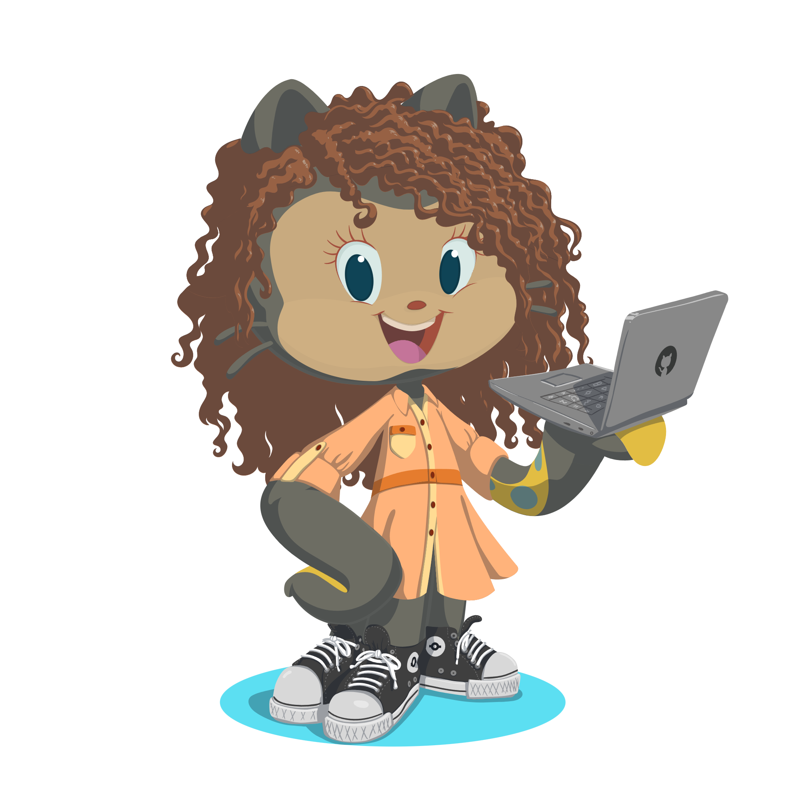

  

<h1 align="center">Olá, eu sou a Thainara 👋</h1>

  🌟 Estudante de Engenharia de Software explorando o mundo da tecnologia e desenvolvimento!

---

### 🚀 Sobre mim

- 🌱 Aprendendo sobre **programação, desenvolvimento web, lógica e ferramentas de software**
- 💡 Curiosa e sempre aberta a novos aprendizados
- 🔍 Interessada em participar de projetos, estudos colaborativos e comunidades tech

---

### 💻 Tecnologias que estou conhecendo:

  
  
  
  <!-- Você pode adicionar outras tecnologias conforme for aprendendo -->

---

### 📫 Onde me encontrar:

- 💼 [LinkedIn](https://www.linkedin.com/in/thainara-m-v-costa)
- 📍 Brasil

---

  Obrigada pela visita! 😊 
  <i>“No começo ninguém sabe tudo — o importante é continuar tentando!”</i>

<!--
**ThainaraM/ThainaraM** is a ✨ _special_ ✨ repository because its `README.md` (this file) appears on your GitHub profile.

Here are some ideas to get you started:

- 🔭 I’m currently working on ...
- 🌱 I’m currently learning ...
- 👯 I’m looking to collaborate on ...
- 🤔 I’m looking for help with ...
- 💬 Ask me about ...
- 📫 How to reach me: ...
- 😄 Pronouns: ...
- ⚡ Fun fact: ...
-->
